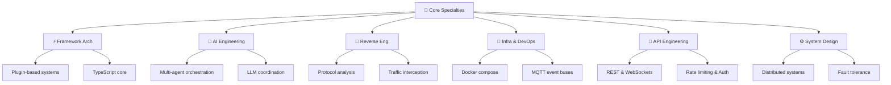
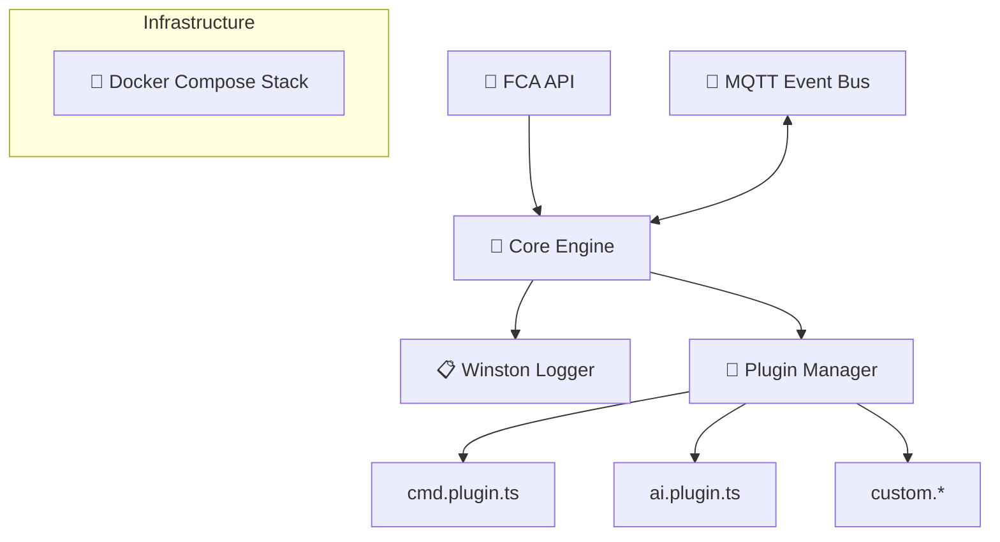

<div align="center">
  
  
  <br><br>
  
  
  
  <br><br>

  <!-- STATUS BADGES -->
  <a href="https://github.com/ASURA2123"></a>&ensp;
  <a href="https://github.com/ASURA2123"></a>&ensp;
  <a href="https://github.com/ASURA2123"></a>&ensp;
  <a href="https://github.com/ASURA2123"></a>&ensp;
  <a href="mailto:denho123oknguyenducanh@gmail.com"></a>
</div>

<br><br>

<!-- PREMIUM GLOWING NEON DIVIDER 1 -->
<div align="center">
  <svg xmlns="http://www.w3.org/2000/svg" viewBox="0 0 1200 6" width="100%" height="6">
    <defs>
      <linearGradient id="neon-divider-grad-1" x1="0%" y1="0%" x2="100%" y2="0%">
        <stop offset="0%" stop-color="#6D28D9" stop-opacity="0" />
        <stop offset="25%" stop-color="#6D28D9" stop-opacity="0.85" />
        <stop offset="50%" stop-color="#C084FC" stop-opacity="1" />
        <stop offset="75%" stop-color="#6D28D9" stop-opacity="0.85" />
        <stop offset="100%" stop-color="#6D28D9" stop-opacity="0" />
      </linearGradient>
    </defs>
    <rect y="2" width="1200" height="2" fill="url(#neon-divider-grad-1)" rx="1" />
  </svg>
</div>

<!-- ======================================================================= -->
<!-- ======================= § 02 · ABOUT ME =============================== -->
<!-- ======================================================================= -->

<br><br>

<div align="center">
  <pre><code>╔═══════════════════════════════════════════════════════════════╗
║  ◈  W H O   A M   I  ◈                                       ║
╚═══════════════════════════════════════════════════════════════╝</code></pre>

  <h3 align="center">> whoami</h3>
</div>

<!-- VIRTUAL SYSTEM DATA (VERTICAL LAYER TO PREVENT SQUISHING) -->
<div align="center">
  <pre><code class="language-yaml">┌─────────────────────────────────────────┐
│  alias        : ASURA2123               │
│  pronouns     : he/him                  │
│  nationality  : Vietnamese 🇻🇳           │
│  timezone     : Asia/Ho_Chi_Minh UTC+7  │
├─────────────────────────────────────────┤
│  role         : Full Stack Backend Dev  │
│               + Framework Architect     │
│               + AI Systems Engineer     │
├─────────────────────────────────────────┤
│  specialty    : Messenger Bot Systems   │
│               + Multi-Agent AI Infra    │
│               + Automation Pipelines    │
│               + Protocol RE             │
├─────────────────────────────────────────┤
│  current      : FCA NextGen Framework   │
│  focus        : AI Agent Coordinator    │
├─────────────────────────────────────────┤
│  motto        : "Code. Optimize.        │
│                  Evolve."               │
│  vibe         : 🌙 night owl coder      │
│  fuel         : ☕ coffee + lofi beats  │
└─────────────────────────────────────────┘</code></pre>
</div>

<br>

<!-- PREMIUM INLINE HARDWARE-ACCELERATED SVG WHOAMI PANEL -->
<div align="center">
  <svg xmlns="http://www.w3.org/2000/svg" viewBox="0 0 450 150" width="350" height="117">
    <rect width="450" height="150" rx="10" fill="#0d1117" stroke="#A855F7" stroke-width="1.5" />
    
    <!-- Window Control Buttons -->
    <circle cx="25" cy="20" r="5" fill="#ff5f56" />
    <circle cx="40" cy="20" r="5" fill="#ffbd2e" />
    <circle cx="55" cy="20" r="5" fill="#27c93f" />
    <text x="80" y="24" fill="#8b949e" font-family="Fira Code, monospace" font-size="11">system@asura:~/fca-nextgen</text>
    
    <!-- Code Lines -->
    <g font-family="Fira Code, monospace" font-size="12" fill="#c9d1d9">
      <text x="25" y="55">
        <tspan fill="#8b5cf6">const</tspan> <tspan fill="#c084fc">system</tspan> = <tspan fill="#8b5cf6">new</tspan> <tspan fill="#e9d5ff">FCANextGen</tspan>();
      </text>
      
      <text x="25" y="80">
        <tspan fill="#c084fc">system</tspan>.<tspan fill="#f9e2af">initialize</tspan>({ <tspan fill="#a855f7">agent</tspan>: <tspan fill="#a6e3a1">"AI_CORE"</tspan> });
      </text>
      
      <text x="25" y="108">
        <tspan fill="#22c55e">> [SYSTEM] FCANextGen Active • Listening...</tspan>
        <animate attributeName="opacity" values="0.3;1;0.3;1" dur="2.5s" repeatCount="indefinite" />
      </text>
    </g>
    
    <!-- Cursor -->
    <rect x="365" y="96" width="8" height="14" fill="#C084FC">
      <animate attributeName="opacity" values="0;1;0" dur="1s" repeatCount="indefinite" />
    </rect>
  </svg>
</div>

<br><br>

<div align="center">
  <pre><code> ✦ · · · · · · · · · · · · · · ✦
 ·  I build systems that scale  ·
 ·  I automate what's manual    ·
 ·  I push boundaries daily     ·
 ✦ · · · · · · · · · · · · · · ✦</code></pre>

  <br>

  <a href="https://github.com/ASURA2123"></a>&ensp;
  <a href="https://github.com/ASURA2123?tab=followers"></a>
</div>

<br><br>

<blockquote>
  <p>💬 &nbsp;I'm <b>ASURA2123</b>, a passionate Backend Developer and Framework Architect from Vietnam 🇻🇳. I specialize in building <b>high-performance automation systems</b>, <b>AI-driven bot frameworks</b>, and <b>distributed multi-agent pipelines</b> — all powered by deep TypeScript and Node.js expertise.</p>
  
  <p>My flagship creation — the <b>FCA Unofficial NextGen Framework</b> — is a plugin-based Messenger bot engine built for production-grade reliability at scale. I thrive on reverse engineering protocols, designing elegant plugin systems, and evolving infrastructure that just <i>works</i>.</p>
</blockquote>

<br><br>

<!-- PREMIUM GLOWING NEON DIVIDER 2 -->
<div align="center">
  <svg xmlns="http://www.w3.org/2000/svg" viewBox="0 0 1200 6" width="100%" height="6">
    <defs>
      <linearGradient id="neon-divider-grad-2" x1="0%" y1="0%" x2="100%" y2="0%">
        <stop offset="0%" stop-color="#6D28D9" stop-opacity="0" />
        <stop offset="25%" stop-color="#6D28D9" stop-opacity="0.85" />
        <stop offset="50%" stop-color="#C084FC" stop-opacity="1" />
        <stop offset="75%" stop-color="#6D28D9" stop-opacity="0.85" />
        <stop offset="100%" stop-color="#6D28D9" stop-opacity="0" />
      </linearGradient>
    </defs>
    <rect y="2" width="1200" height="2" fill="url(#neon-divider-grad-2)" rx="1" />
  </svg>
</div>

<!-- ======================================================================= -->
<!-- ======================= § 03 · TECH ARSENAL =========================== -->
<!-- ======================================================================= -->

<br><br>

<div align="center">
  <h2 align="center">⚡ Tech Arsenal</h2>

  <pre><code>✦・┈┈┈┈┈┈┈┈┈┈┈┈┈┈・✦・┈┈┈┈┈┈┈┈┈┈┈┈┈┈・✦
           T E C H   S T A C K
✦・┈┈┈┈┈┈┈┈┈┈┈┈┈┈・✦・┈┈┈┈┈┈┈┈┈┈┈┈┈┈・✦</code></pre>
</div>

<br>

<!-- LANGUAGES -->
<div align="center">
  <p><b>◈ LANGUAGES</b></p>
  
  
  <br><br>
  
  <a href="https://www.typescriptlang.org/"></a>&ensp;
  <a href="https://developer.mozilla.org/en-US/docs/Web/JavaScript"></a>&ensp;
  <a href="https://python.org"></a>&ensp;
  <a href="https://www.gnu.org/software/bash/"></a>
</div>

<br><br>

<!-- BACKEND -->
<div align="center">
  <p><b>◈ BACKEND & RUNTIME</b></p>
  
  
  <br><br>
  
  <a href="https://nodejs.org/"></a>&ensp;
  <a href="https://expressjs.com/"></a>&ensp;
  <a href="https://www.fastify.io/"></a>&ensp;
  <a href="https://fastapi.tiangolo.com/"></a>&ensp;
  <a href="https://bun.sh/"></a>
</div>

<br><br>

<!-- DATABASE -->
<div align="center">
  <p><b>◈ DATABASE & STORAGE</b></p>
  
  
  <br><br>
  
  <a href="https://www.mongodb.com/"></a>&ensp;
  <a href="https://redis.io/"></a>&ensp;
  <a href="https://www.mysql.com/"></a>&ensp;
  <a href="https://www.sqlite.org/"></a>
</div>

<br><br>

<!-- DEVOPS -->
<div align="center">
  <p><b>◈ DEVOPS & INFRASTRUCTURE</b></p>
  
  
  <br><br>
  
  <a href="https://www.docker.com/"></a>&ensp;
  <a href="https://mqtt.org/"></a>&ensp;
  <a href="https://www.nginx.com/"></a>&ensp;
  <a href="https://pm2.keymetrics.io/"></a>&ensp;
  <a href="https://github.com/features/actions"></a>
</div>

<br><br>

<!-- AI/ML -->
<div align="center">
  <p><b>◈ AI / ML & LLM</b></p>
  
  
  <br><br>
  
  <a href="https://openai.com/"></a>&ensp;
  <a href="https://www.langchain.com/"></a>&ensp;
  <a href="https://ollama.com/"></a>&ensp;
  <a href="https://www.tensorflow.org/"></a>&ensp;
  <a href="https://pytorch.org/"></a>
</div>

<br><br>

<!-- TOOLS -->
<div align="center">
  <p><b>◈ TOOLS & ECOSYSTEM</b></p>
  
  
  <br><br>
  
  <a href="https://git-scm.com/"></a>&ensp;
  <a href="https://code.visualstudio.com/"></a>&ensp;
  <a href="https://www.postman.com/"></a>&ensp;
  <a href="https://pptr.dev/"></a>&ensp;
  <a href="https://socket.io/"></a>
</div>

<br><br>

<!-- OS -->
<div align="center">
  <p><b>◈ OPERATING SYSTEMS</b></p>
  
  
  <br><br>
  
  <a href="https://ubuntu.com/"></a>&ensp;
  <a href="https://www.debian.org/"></a>&ensp;
  <a href="https://www.microsoft.com/windows"></a>
</div>

<br><br>

<!-- Full stack details collapsible (Converted to full clean HTML Table) -->
<details>
  <summary align="center"><b>📋 &nbsp; View Complete Tech Details</b></summary>
  
  <br>
  
  <div align="center">
    <table width="90%">
      <thead>
        <tr>
          <th align="center" width="25%">🏷️ Category</th>
          <th align="left" width="60%">🛠️ Technologies</th>
          <th align="center" width="15%">📊 Level</th>
        </tr>
      </thead>
      <tbody>
        <tr>
          <td align="center"><b>Languages</b></td>
          <td align="left">TypeScript · JavaScript ES2022+ · Python 3.x · Bash/Shell</td>
          <td align="center">Expert</td>
        </tr>
        <tr>
          <td align="center"><b>Runtime</b></td>
          <td align="left">Node.js v20 · Bun · Deno (exp.)</td>
          <td align="center">Expert</td>
        </tr>
        <tr>
          <td align="center"><b>Frameworks</b></td>
          <td align="left">Express · Fastify · FastAPI · Custom FCA NextGen</td>
          <td align="center">Expert</td>
        </tr>
        <tr>
          <td align="center"><b>Databases</b></td>
          <td align="left">MongoDB · Redis · MySQL · SQLite · Supabase</td>
          <td align="center">Advanced</td>
        </tr>
        <tr>
          <td align="center"><b>Messaging</b></td>
          <td align="left">MQTT · RabbitMQ · Socket.io · WebSocket native</td>
          <td align="center">Advanced</td>
        </tr>
        <tr>
          <td align="center"><b>DevOps</b></td>
          <td align="left">Docker · Compose · PM2 · GitHub Actions · Nginx</td>
          <td align="center">Advanced</td>
        </tr>
        <tr>
          <td align="center"><b>AI / LLM</b></td>
          <td align="left">OpenAI API · LangChain · Ollama · HuggingFace</td>
          <td align="center">Proficient</td>
        </tr>
        <tr>
          <td align="center"><b>Testing</b></td>
          <td align="left">Jest · Vitest · Mocha · Custom E2E harnesses</td>
          <td align="center">Advanced</td>
        </tr>
        <tr>
          <td align="center"><b>Code Quality</b></td>
          <td align="left">ESLint · Prettier · TypeScript Strict · Zod</td>
          <td align="center">Expert</td>
        </tr>
        <tr>
          <td align="center"><b>Libraries</b></td>
          <td align="left">Winston · Axios · Puppeteer · Cheerio · Cron</td>
          <td align="center">Expert</td>
        </tr>
      </tbody>
    </table>
  </div>
</details>

<br><br>

<!-- PREMIUM GLOWING NEON DIVIDER 3 -->
<div align="center">
  <svg xmlns="http://www.w3.org/2000/svg" viewBox="0 0 1200 6" width="100%" height="6">
    <defs>
      <linearGradient id="neon-divider-grad-3" x1="0%" y1="0%" x2="100%" y2="0%">
        <stop offset="0%" stop-color="#6D28D9" stop-opacity="0" />
        <stop offset="25%" stop-color="#6D28D9" stop-opacity="0.85" />
        <stop offset="50%" stop-color="#C084FC" stop-opacity="1" />
        <stop offset="75%" stop-color="#6D28D9" stop-opacity="0.85" />
        <stop offset="100%" stop-color="#6D28D9" stop-opacity="0" />
      </linearGradient>
    </defs>
    <rect y="2" width="1200" height="2" fill="url(#neon-divider-grad-3)" rx="1" />
  </svg>
</div>

<!-- ======================================================================= -->
<!-- ======================= § 04 · GITHUB ANALYTICS ======================= -->
<!-- ======================================================================= -->

<br><br>

<div align="center">
  <h2 align="center">📊 GitHub Analytics</h2>

  <pre><code>╔══════════════════════════════════════════════════════════════╗
║  ◈  D A T A B O A R D  ◈                                     ║
╚══════════════════════════════════════════════════════════════╝</code></pre>
</div>

<!-- Cyberpunk ASCII Dashboard -->
<div align="center">
  <pre><code>┌─── 📊 GITHUB SYSTEM METRICS ──────────────────────────────────┐
│                                                               │
│   Commits  ████████████████████████████░░░░░░░░  1,428        │
│   Stars    ████████████████░░░░░░░░░░░░░░░░░░░░  124          │
│   PRs      ██████████████████████░░░░░░░░░░░░░░  412          │
│   Issues   ████████░░░░░░░░░░░░░░░░░░░░░░░░░░░░  89           │
│                                                               │
├─── 🏆 CONTRIBUTION STREAKS ───────────────────────────────────┤
│                                                               │
│   Current Streak : 42 Days  (Started: 2026-04-10)             │
│   Longest Streak : 89 Days  (Record: 2025-11-01)              │
│                                                               │
├─── 💻 MOST USED LANGUAGES ────────────────────────────────────┤
│                                                               │
│   TypeScript ░░░░░ 48.2%   │   Python     ░░░░░ 22.1%         │
│   JavaScript ░░░░░ 15.4%   │   Bash/Shell ░░░░░ 14.3%         │
│   │                                                           │
└───────────────────────────────────────────────────────────────┘</code></pre>
</div>

<br><br>

<!-- Collapsible Live Charts (Option for users to load dynamic charts) -->
<details>
  <summary align="center"><b>📊 Click to load Live Dynamic Charts (May encounter rate-limits)</b></summary>
  
  <br><br>
  
  <div align="center">
    
    
    <br><br>
    
    
    
    <br><br>
    
    
    
    <br><br>
    
    
    
    <br><br>
    
    
    
    <br><br>
    
    
  </div>
</details>

<br><br>

<!-- PREMIUM GLOWING NEON DIVIDER 4 -->
<div align="center">
  <svg xmlns="http://www.w3.org/2000/svg" viewBox="0 0 1200 6" width="100%" height="6">
    <defs>
      <linearGradient id="neon-divider-grad-4" x1="0%" y1="0%" x2="100%" y2="0%">
        <stop offset="0%" stop-color="#6D28D9" stop-opacity="0" />
        <stop offset="25%" stop-color="#6D28D9" stop-opacity="0.85" />
        <stop offset="50%" stop-color="#C084FC" stop-opacity="1" />
        <stop offset="75%" stop-color="#6D28D9" stop-opacity="0.85" />
        <stop offset="100%" stop-color="#6D28D9" stop-opacity="0" />
      </linearGradient>
    </defs>
    <rect y="2" width="1200" height="2" fill="url(#neon-divider-grad-4)" rx="1" />
  </svg>
</div>

<!-- ======================================================================= -->
<!-- ======================= § 05 · SPECIALTIES ============================ -->
<!-- ======================================================================= -->

<br><br>

<div align="center">
  <h2 align="center">🧠 Core Specialties</h2>

  <pre><code>✦・┈┈┈┈┈┈┈┈┈┈┈┈┈┈┈┈┈┈┈┈┈┈┈・✦
       S P E C I A L T I E S
✦・┈┈┈┈┈┈┈┈┈┈┈┈┈┈┈┈┈┈┈┈┈┈┈・✦</code></pre>
</div>

<div align="center">



</div>

<br><br>

<!-- Skill bars in elegant HTML table -->
<div align="center">
  <table width="90%">
    <thead>
      <tr>
        <th align="left" width="30%">Skill</th>
        <th align="center" width="55%">Proficiency</th>
        <th align="center" width="15%">Level</th>
      </tr>
    </thead>
    <tbody>
      <tr>
        <td align="left"><code>TypeScript / Node.js</code></td>
        <td align="center"><code>████████████░</code> 95%</td>
        <td align="center">⭐ Expert</td>
      </tr>
      <tr>
        <td align="left"><code>Framework Architecture</code></td>
        <td align="center"><code>███████████░░</code> 90%</td>
        <td align="center">⭐ Expert</td>
      </tr>
      <tr>
        <td align="left"><code>REST API & WebSocket</code></td>
        <td align="center"><code>███████████░░</code> 90%</td>
        <td align="center">⭐ Expert</td>
      </tr>
      <tr>
        <td align="left"><code>AI System Integration</code></td>
        <td align="center"><code>██████████░░░</code> 82%</td>
        <td align="center">🔥 Advanced</td>
      </tr>
      <tr>
        <td align="left"><code>Docker & Containers</code></td>
        <td align="center"><code>██████████░░░</code> 80%</td>
        <td align="center">🔥 Advanced</td>
      </tr>
      <tr>
        <td align="left"><code>Protocol Reverse Eng.</code></td>
        <td align="center"><code>██████████░░░</code> 85%</td>
        <td align="center">🔥 Advanced</td>
      </tr>
      <tr>
        <td align="left"><code>Python Automation</code></td>
        <td align="center"><code>█████████░░░░</code> 78%</td>
        <td align="center">🔥 Advanced</td>
      </tr>
      <tr>
        <td align="left"><code>Performance Optimization</code></td>
        <td align="center"><code>████████░░░░░</code> 75%</td>
        <td align="center">📈 Proficient</td>
      </tr>
      <tr>
        <td align="left"><code>Security Engineering</code></td>
        <td align="center"><code>████████░░░░░</code> 72%</td>
        <td align="center">📈 Proficient</td>
      </tr>
    </tbody>
  </table>
</div>

<br><br>

<!-- PREMIUM GLOWING NEON DIVIDER 5 -->
<div align="center">
  <svg xmlns="http://www.w3.org/2000/svg" viewBox="0 0 1200 6" width="100%" height="6">
    <defs>
      <linearGradient id="neon-divider-grad-5" x1="0%" y1="0%" x2="100%" y2="0%">
        <stop offset="0%" stop-color="#6D28D9" stop-opacity="0" />
        <stop offset="25%" stop-color="#6D28D9" stop-opacity="0.85" />
        <stop offset="50%" stop-color="#C084FC" stop-opacity="1" />
        <stop offset="75%" stop-color="#6D28D9" stop-opacity="0.85" />
        <stop offset="100%" stop-color="#6D28D9" stop-opacity="0" />
      </linearGradient>
    </defs>
    <rect y="2" width="1200" height="2" fill="url(#neon-divider-grad-5)" rx="1" />
  </svg>
</div>

<!-- ======================================================================= -->
<!-- ======================= § 06 · FEATURED PROJECTS ====================== -->
<!-- ======================================================================= -->

<br><br>

<div align="center">
  <h2 align="center">🚀 Featured Projects</h2>

  <pre><code>╔══════════════════════════════════════════════════════════════╗
║  ◈  P R O J E C T   S H O W C A S E  ◈                      ║
╚══════════════════════════════════════════════════════════════╝</code></pre>
</div>

<br>

<!-- PROJECT 01 -->
<div align="center">
  <pre><code>╭─────────────────────────────────────────────────────────────────╮
│  ⚡  PROJECT 01                                                  │
╰─────────────────────────────────────────────────────────────────╯</code></pre>
</div>

<h3 align="left">⚡ Project 01: FCA Unofficial NextGen Framework</h3>

<div align="left">
  <a href="https://github.com/ASURA2123"></a>&ensp;
  <a href="https://github.com/ASURA2123"></a>&ensp;
  <a href="https://github.com/ASURA2123"></a>&ensp;
  <a href="https://github.com/ASURA2123"></a>&ensp;
  <a href="https://github.com/ASURA2123"></a>
</div>

<br>

<blockquote>
  <b>A production-grade, plugin-based Messenger bot framework</b> engineered from the ground up for scalability, modularity, and reliability. Featuring a TypeScript core, hot-swap plugin architecture, MQTT event bus, Docker deployment pipeline, and a high-performance structured logging system.
</blockquote>

<br>

<h4 align="left">📊 Architecture Flow</h4>

<div align="center">



</div>

<br>

<h4 align="left">🔑 Key Features</h4>
<ul>
  <li>🔌 <b>Plugin Architecture</b> — Hot-swappable command modules — zero restart required</li>
  <li>🐳 <b>Docker Pipeline</b> — Full Compose stack with zero-downtime rolling updates</li>
  <li>📡 <b>MQTT Event Bus</b> — Real-time event distribution across distributed agent nodes</li>
  <li>🔐 <b>Secure Auth</b> — Token authentication + auto session refresh for FCA API</li>
  <li>📋 <b>HP Logging</b> — Winston-based structured JSON pipeline with log rotation</li>
  <li>🧩 <b>Modular Core</b> — Clean separation: core / plugins / adapters / config</li>
  <li>⚡ <b>TypeScript First</b> — Full strict-mode TS — type-safe from top to bottom</li>
  <li>🔄 <b>Runtime Optimization</b> — Event loop tuning, memory management, GC profiling</li>
</ul>

<br>

<div align="left">
  <a href="https://github.com/ASURA2123"></a>&ensp;
  <a href="https://github.com/ASURA2123"></a>
</div>

<br><br>

<!-- PROJECT 02 -->
<div align="center">
  <pre><code>╭─────────────────────────────────────────────────────────────────╮
│  🤖  PROJECT 02                                                  │
╰─────────────────────────────────────────────────────────────────╯</code></pre>
</div>

<h3 align="left">🤖 Project 02: Multi-Agent AI Coordination Pipeline</h3>

<div align="left">
  <a href="https://github.com/ASURA2123"></a>&ensp;
  <a href="https://github.com/ASURA2123"></a>&ensp;
  <a href="https://github.com/ASURA2123"></a>&ensp;
  <a href="https://github.com/ASURA2123"></a>
</div>

<br>

<blockquote>
  🧠 <b>A distributed multi-agent infrastructure</b> enabling autonomous AI task execution with parallel processing, intelligent NLP-based command routing, and fault-tolerant coordination — fully integrated with the NextGen bot ecosystem.
</blockquote>

<br>

<h4 align="left">🔑 Key Features</h4>
<ul>
  <li>🎯 <b>Agent Coordinator</b> — Dynamic task delegation with real-time load balancing</li>
  <li>🧠 <b>LLM Integration</b> — Intelligent command parsing using NLP via LLM endpoints</li>
  <li>📬 <b>Retry Queues</b> — Fault-tolerant queues with exponential backoff</li>
  <li>⚖️ <b>Parallel Execution</b> — Concurrent multi-agent processing without bottlenecks</li>
  <li>🔗 <b>NextGen Integration</b> — Native plugin for FCA NextGen Framework ecosystem</li>
</ul>

<br>

<div align="left">
  <a href="https://github.com/ASURA2123"></a>
</div>

<br><br>

<!-- PROJECT 03 -->
<div align="center">
  <pre><code>╭─────────────────────────────────────────────────────────────────╮
│  🔍  PROJECT 03                                                  │
╰─────────────────────────────────────────────────────────────────╯</code></pre>
</div>

<h3 align="left">🔍 Project 03: Protocol Reverse Engineering Toolkit</h3>

<div align="left">
  <a href="https://github.com/ASURA2123"></a>&ensp;
  <a href="https://github.com/ASURA2123"></a>&ensp;
  <a href="https://github.com/ASURA2123"></a>&ensp;
  <a href="https://github.com/ASURA2123"></a>
</div>

<br>

<blockquote>
  🔬 <b>A specialized toolchain for analyzing and reverse engineering private web protocols</b> — generating unofficial API wrappers, intercepting platform traffic, and automating token/session lifecycle management for Messenger and similar platforms.
</blockquote>

<br>

<h4 align="left">🔑 Core Capabilities</h4>
<ul>
  <li>🌐 <b>Headless Browser Automation</b> — High-performance browser manipulation with fingerprint spoofing</li>
  <li>📡 <b>HTTP Traffic Interception</b> — Custom sniffing engines for raw network protocol decoding</li>
  <li>🍪 <b>Session Management</b> — Automated cookie/token extraction & persistence</li>
  <li>🔄 <b>Lifecycle Automation</b> — Session refresh triggers & auto reconnection layers</li>
  <li>🧩 <b>Wrapper Generation</b> — Automated code generation for custom platform wrappers</li>
  <li>🛡️ <b>Anti-Fingerprinting</b> — Dynamic proxy rotation and user-agent generation</li>
</ul>

<br>

<div align="left">
  <a href="https://github.com/ASURA2123"></a>
</div>

<br><br>

<!-- PREMIUM GLOWING NEON DIVIDER 6 -->
<div align="center">
  <svg xmlns="http://www.w3.org/2000/svg" viewBox="0 0 1200 6" width="100%" height="6">
    <defs>
      <linearGradient id="neon-divider-grad-6" x1="0%" y1="0%" x2="100%" y2="0%">
        <stop offset="0%" stop-color="#6D28D9" stop-opacity="0" />
        <stop offset="25%" stop-color="#6D28D9" stop-opacity="0.85" />
        <stop offset="50%" stop-color="#C084FC" stop-opacity="1" />
        <stop offset="75%" stop-color="#6D28D9" stop-opacity="0.85" />
        <stop offset="100%" stop-color="#6D28D9" stop-opacity="0" />
      </linearGradient>
    </defs>
    <rect y="2" width="1200" height="2" fill="url(#neon-divider-grad-6)" rx="1" />
  </svg>
</div>

<!-- ======================================================================= -->
<!-- ======================= § 07 · EXPERIENCE ============================= -->
<!-- ======================================================================= -->

<br><br>

<div align="center">
  <h2 align="center">💼 Experience</h2>

  <pre><code>╔══════════════════════════════════════════════════════════════╗
║  ◈  C A R E E R   T I M E L I N E  ◈                        ║
╚══════════════════════════════════════════════════════════════╝</code></pre>
</div>

<div align="center">
  <pre><code> 2026 ▓▓▓▓▓▓▓▓▓▓▓▓▓▓▓▓▓▓▓▓▓▓▓▓▓▓▓▓▓▓▓▓▓▓▓▓▓▓▓▓▓▓▓▓▓▓▓▓▓▓▓▓▓▓▓▓▓▓▓▓▓
  │
  │   ╔═══════════════════════════════════════════════════════════╗
  │   ║  ⚡ Lead Framework Architect                              ║
  ├──▶║  FCA Unofficial NextGen Framework • Open Source           ║
  │   ║  📅 2023 — Present                                        ║
  │   ╠═══════════════════════════════════════════════════════════╣
  │   ║  ›  Designed plugin-based architecture with hot-swap      ║
  │   ║     command modules (zero-restart updates)                ║
  │   ║  ›  Built Winston logging pipeline (structured JSON)      ║
  │   ║  ›  Integrated MQTT broker for multi-node event bus       ║
  │   ║  ›  Containerized full stack via Docker Compose           ║
  │   ║  ›  Implemented FCA token auth + session refresh          ║
  │   ╠═══════════════════════════════════════════════════════════╣
  │   ║  Stack: TypeScript · Node.js · Docker · MQTT · Winston    ║
  │   ╚═══════════════════════════════════════════════════════════╝
  │
  │   ╔═══════════════════════════════════════════════════════════╗
  │   ║  🤖 AI Systems Developer                                  ║
  ├──▶║  Multi-Agent Automation Infrastructure • Personal         ║
  │   ║  📅 2024 — Present                                        ║
  │   ╠═══════════════════════════════════════════════════════════╣
  │   ║  ›  Built multi-agent coordinator with load balancing     ║
  │   ║  ›  Integrated LLM endpoints for intelligent routing      ║
  │   ║  ›  Designed fault-tolerant queues w/ exponential backoff ║
  │   ║  ›  Deployed parallel agent processing pipelines          ║
  │   ╠═══════════════════════════════════════════════════════════╣
  │   ║  Stack: Python · Node.js · LLM APIs · Queue Systems       ║
  │   ╚═══════════════════════════════════════════════════════════╝
  │
  │   ╔═══════════════════════════════════════════════════════════╗
  │   ║  🔧 Backend Developer & Automation Engineer               ║
  ├──▶║  Independent / Freelance Client Work                      ║
  │   ║  📅 2022 — 2023                                           ║
  │   ╠═══════════════════════════════════════════════════════════╣
  │   ║  ›  Automated social workflows → cut manual effort 80%+   ║
  │   ║  ›  Built Express.js + MongoDB REST APIs for clients      ║
  │   ║  ›  Reverse engineered Messenger protocols → wrappers     ║
  │   ║  ›  Delivered production systems: stable + performant     ║
  │   ╠═══════════════════════════════════════════════════════════╣
  │   ║  Stack: JavaScript · Express.js · MongoDB · Puppeteer     ║
  │   ╚═══════════════════════════════════════════════════════════╝
  │
 2022 ▓▓▓▓▓▓▓▓▓▓▓▓▓▓▓▓▓▓▓▓▓▓▓▓▓▓▓▓▓▓▓▓▓▓▓▓▓▓▓▓▓▓▓▓▓▓▓▓▓▓▓▓▓▓▓▓▓▓▓▓▓</code></pre>
</div>

<br><br>

<!-- PREMIUM GLOWING NEON DIVIDER 7 -->
<div align="center">
  <svg xmlns="http://www.w3.org/2000/svg" viewBox="0 0 1200 6" width="100%" height="6">
    <defs>
      <linearGradient id="neon-divider-grad-7" x1="0%" y1="0%" x2="100%" y2="0%">
        <stop offset="0%" stop-color="#6D28D9" stop-opacity="0" />
        <stop offset="25%" stop-color="#6D28D9" stop-opacity="0.85" />
        <stop offset="50%" stop-color="#C084FC" stop-opacity="1" />
        <stop offset="75%" stop-color="#6D28D9" stop-opacity="0.85" />
        <stop offset="100%" stop-color="#6D28D9" stop-opacity="0" />
      </linearGradient>
    </defs>
    <rect y="2" width="1200" height="2" fill="url(#neon-divider-grad-7)" rx="1" />
  </svg>
</div>

<!-- ======================================================================= -->
<!-- ======================= § 08 · EDUCATION & CERTS ====================== -->
<!-- ======================================================================= -->

<br><br>

<div align="center">
  <h2 align="center">🎓 Education & Certifications</h2>

  <pre><code>✦・┈┈┈┈┈┈┈┈┈┈┈┈┈┈┈┈┈┈┈┈┈┈┈┈┈┈┈・✦
  E D U C A T I O N  &  C E R T S
✦・┈┈┈┈┈┈┈┈┈┈┈┈┈┈┈┈┈┈┈┈┈┈┈┈┈┈┈・✦</code></pre>
</div>

<br>

<h3 align="left">📚 Education</h3>
<ul>
  <li>
    <b>🎓 Self-Taught Software Engineer</b> (<code>2021 — Present</code>)<br>
    <i>Independent Research & Practice</i>
    <blockquote>Deep hands-on learning via real production projects in backend systems, bot engineering, AI automation & system architecture.</blockquote>
  </li>
  <li>
    <b>📖 Continuous Self-Learning</b> (<code>Ongoing</code>)<br>
    <i>freeCodeCamp · MDN · Node.js Docs · Docker Docs · Research Papers</i>
  </li>
</ul>

<br>

<h3 align="left">🏆 Achievements & Certifications</h3>
<ul>
  <li>🏆 <b>Published Open Source Framework</b> — <i>FCA Unofficial NextGen · GitHub · 2023</i></li>
  <li>⚡ <b>Node.js Complete Guide</b> — <i>Self-completed · Udemy + Official Docs · 2022</i></li>
  <li>🐳 <b>Docker & Container Orchestration</b> — <i>Docker Official Learning Path · 2023</i></li>
  <li>🤖 <b>AI Systems & LLM Integration</b> — <i>Project-Based Practical Learning · 2024</i></li>
  <li>🔐 <b>Protocol Analysis & Reverse Engineering</b> — <i>Self-research & CTF Practice · 2022-2024</i></li>
</ul>

<br><br>

<!-- PREMIUM GLOWING NEON DIVIDER 8 -->
<div align="center">
  <svg xmlns="http://www.w3.org/2000/svg" viewBox="0 0 1200 6" width="100%" height="6">
    <defs>
      <linearGradient id="neon-divider-grad-8" x1="0%" y1="0%" x2="100%" y2="0%">
        <stop offset="0%" stop-color="#6D28D9" stop-opacity="0" />
        <stop offset="25%" stop-color="#6D28D9" stop-opacity="0.85" />
        <stop offset="50%" stop-color="#C084FC" stop-opacity="1" />
        <stop offset="75%" stop-color="#6D28D9" stop-opacity="0.85" />
        <stop offset="100%" stop-color="#6D28D9" stop-opacity="0" />
      </linearGradient>
    </defs>
    <rect y="2" width="1200" height="2" fill="url(#neon-divider-grad-8)" rx="1" />
  </svg>
</div>

<!-- ======================================================================= -->
<!-- ======================= § 09 · ROADMAP & GOALS ======================== -->
<!-- ======================================================================= -->

<br><br>

<div align="center">
  <h2 align="center">🎯 Current Goals & Learning</h2>

  <pre><code>╔══════════════════════════════════════════════════════════════╗
║  ◈  R O A D M A P   2 0 2 6  ◈                              ║
╚══════════════════════════════════════════════════════════════╝</code></pre>
</div>

<br>

<h3 align="left">🔭 Building Now</h3>
<ul>
  <li>🚀 <b>FCA NextGen v2.0</b> — Plugin runtime rewrite · Better DX & docs · Public release</li>
  <li>🤖 <b>Multi-Agent Coordinator</b> — Parallel pipelines · Task scheduler · Health monitoring</li>
  <li>🔍 <b>RE Toolkit Unified</b> — All-in-one workbench · Proxy rotation · Protocol parser</li>
</ul>

<br>

<h3 align="left">📖 Learning Now</h3>
<ul>
  <li>🦀 <b>Rust</b> — Systems programming · WASM integration · High-perf modules</li>
  <li>☸️ <b>Kubernetes</b> — Container orchestration · Helm charts · Production k8s</li>
  <li>🧠 <b>Advanced LLM</b> — Fine-tuning pipelines · RAG architectures · Vector databases</li>
</ul>

<br>

<h3 align="left">🌐 Goals 2026</h3>
<ul>
  <li>📦 <b>Ship NextGen v2.0 stable</b> & launch automation SaaS</li>
  <li>⭐ <b>Reach 1k+ GitHub stars</b> and build public docs site</li>
  <li>✍️ <b>Write technical blog</b> and contribute to major OSS</li>
  <li>🛠️ <b>Expand plugin ecosystem</b> & land senior developer role</li>
</ul>

<br>

```typescript
// [EDIT] Update quarterly → goals.ts

const asura2123 = {
  currentlyBuilding : ["FCA NextGen v2.0", "Multi-Agent AI Pipeline", "RE Toolkit"],
  currentlyLearning : ["Rust", "Kubernetes", "LLM Fine-tuning", "RAG Systems"],
  goals2026         : ["1k GitHub Stars", "SaaS Product Launch", "OSS Contributions"],
  funFact           : "I debug best at 2 AM with lofi music 🌙",
  philosophy        : "Ship fast. Iterate faster. Never stop optimizing.",
} as const;
```

<br><br>

<!-- PREMIUM GLOWING NEON DIVIDER 9 -->
<div align="center">
  <svg xmlns="http://www.w3.org/2000/svg" viewBox="0 0 1200 6" width="100%" height="6">
    <defs>
      <linearGradient id="neon-divider-grad-9" x1="0%" y1="0%" x2="100%" y2="0%">
        <stop offset="0%" stop-color="#6D28D9" stop-opacity="0" />
        <stop offset="25%" stop-color="#6D28D9" stop-opacity="0.85" />
        <stop offset="50%" stop-color="#C084FC" stop-opacity="1" />
        <stop offset="75%" stop-color="#6D28D9" stop-opacity="0.85" />
        <stop offset="100%" stop-color="#6D28D9" stop-opacity="0" />
      </linearGradient>
    </defs>
    <rect y="2" width="1200" height="2" fill="url(#neon-divider-grad-9)" rx="1" />
  </svg>
</div>

<!-- ======================================================================= -->
<!-- ======================= § 10 · BATCAVE SETUP ========================== -->
<!-- ======================================================================= -->

<br><br>

<div align="center">
  <h2 align="center">💻 Workspace Setup</h2>

  <pre><code>✦・┈┈┈┈┈┈┈┈┈┈┈┈┈┈┈┈┈┈┈┈┈・✦
    M Y   B A T C A V E
✦・┈┈┈┈┈┈┈┈┈┈┈┈┈┈┈┈┈┈┈┈┈・✦</code></pre>
</div>

<div align="center">
  <pre><code>┌─────────────────────────────────────────────────────────────┐
│  🖥️  asura@nextgen ~ system-info                            │
├─────────────────────────────────────────────────────────────┤
│                                                             │
│  💻 Machine    ├─ Custom Build Workstation                  │
│  ⚡ CPU        ├─ AMD Ryzen / Intel Core i7+                │
│  🎮 GPU        ├─ NVIDIA (CUDA for AI tasks)                │
│  🧠 RAM        ├─ 16GB+ DDR4                                │
│  💾 Storage    ├─ NVMe SSD + HDD backup                     │
│  🖥️ Monitor    ├─ 1080p IPS 144Hz                           │
│  ⌨️ Keyboard   ├─ Mechanical (Blue / Brown switches)        │
│  🖱️ Mouse      ├─ Wireless Precision                        │
│                                                             │
├─────────────────────────────────────────────────────────────┤
│                                                             │
│  🐧 Primary OS ├─ Ubuntu Server 22.04 LTS (VPS/Prod)       │
│  🪟 Dev OS     ├─ Windows 11 (Daily Driver)                 │
│  🐳 Runtime    ├─ Docker + WSL2 for Linux dev               │
│  💡 IDE        ├─ VS Code + Vim (server editing)            │
│  🎨 Theme      ├─ Tokyo Night / Dracula Pro                 │
│  🔤 Font       ├─ Fira Code (ligatures enabled)             │
│  🖥️ Terminal   ├─ Windows Terminal + Oh My Zsh              │
│  🌐 Browser    ├─ Chrome (DevTools power user)              │
│                                                             │
└─────────────────────────────────────────────────────────────┘</code></pre>
</div>

<br><br>

<!-- IDE + OS Badges -->
<div align="center">
  &ensp;
  &ensp;
  &ensp;
  &ensp;
  &ensp;
  &ensp;
  
</div>

<br><br>

<!-- PREMIUM GLOWING NEON DIVIDER 10 -->
<div align="center">
  <svg xmlns="http://www.w3.org/2000/svg" viewBox="0 0 1200 6" width="100%" height="6">
    <defs>
      <linearGradient id="neon-divider-grad-10" x1="0%" y1="0%" x2="100%" y2="0%">
        <stop offset="0%" stop-color="#6D28D9" stop-opacity="0" />
        <stop offset="25%" stop-color="#6D28D9" stop-opacity="0.85" />
        <stop offset="50%" stop-color="#C084FC" stop-opacity="1" />
        <stop offset="75%" stop-color="#6D28D9" stop-opacity="0.85" />
        <stop offset="100%" stop-color="#6D28D9" stop-opacity="0" />
      </linearGradient>
    </defs>
    <rect y="2" width="1200" height="2" fill="url(#neon-divider-grad-10)" rx="1" />
  </svg>
</div>

<!-- ======================================================================= -->
<!-- ======================= § 11 · PHILOSOPHY ============================= -->
<!-- ======================================================================= -->

<br><br>

<div align="center">
  <h2 align="center">🌌 Coding Philosophy</h2>

  <pre><code>◤━━━━━━━━━━━━━━━━━━━━━━━━━━━━━━━━━━━━━━━━━━━━━━━━━━━━━━━━━━◥
               P H I L O S O P H Y   &   V I B E S
◣━━━━━━━━━━━━━━━━━━━━━━━━━━━━━━━━━━━━━━━━━━━━━━━━━━━━━━━━━━◢</code></pre>
</div>

<div align="center">
  <pre><code>┌─────────────────────────────────────────┐
│  🧭 PRINCIPLES                          │
├─────────────────────────────────────────┤
│                                         │
│  ▸ Write code for humans first,        │
│    machines second                      │
│                                         │
│  ▸ If it's not tested, it's broken     │
│                                         │
│  ▸ Premature optimization is the       │
│    root of all evil — but ship fast    │
│                                         │
│  ▸ A good architecture explains itself │
│                                         │
│  ▸ Perfect is the enemy of deployed    │
│                                         │
│  ▸ Always optimize for the 3 AM        │
│    debugging session                    │
│                                         │
└─────────────────────────────────────────┘</code></pre>

  <br>

  <pre><code>┌─────────────────────────────────────────┐
│  🎮 FUN FACTS                           │
├─────────────────────────────────────────┤
│                                         │
│  ✦ Night owl — peak productivity       │
│    kicks in at midnight 🌙              │
│                                         │
│  ✦ Lofi hip-hop + rain sounds =        │
│    unstoppable coding mode 🎵           │
│                                         │
│  ✦ Debugs with console.log before      │
│    reading the error message 😅         │
│                                         │
│  ✦ More terminal tabs than browser     │
│    tabs (usually)                       │
│                                         │
│  ✦ Believes Docker solves 90% of       │
│    "works on my machine" issues 🐳      │
│                                         │
└─────────────────────────────────────────┘</code></pre>
</div>

<br><br>

<!-- PREMIUM GLOWING NEON DIVIDER 11 -->
<div align="center">
  <svg xmlns="http://www.w3.org/2000/svg" viewBox="0 0 1200 6" width="100%" height="6">
    <defs>
      <linearGradient id="neon-divider-grad-11" x1="0%" y1="0%" x2="100%" y2="0%">
        <stop offset="0%" stop-color="#6D28D9" stop-opacity="0" />
        <stop offset="25%" stop-color="#6D28D9" stop-opacity="0.85" />
        <stop offset="50%" stop-color="#C084FC" stop-opacity="1" />
        <stop offset="75%" stop-color="#6D28D9" stop-opacity="0.85" />
        <stop offset="100%" stop-color="#6D28D9" stop-opacity="0" />
      </linearGradient>
    </defs>
    <rect y="2" width="1200" height="2" fill="url(#neon-divider-grad-11)" rx="1" />
  </svg>
</div>

<!-- ======================================================================= -->
<!-- ======================= § 12 · DEV VIBES ============================== -->
<!-- ======================================================================= -->

<br><br>

<div align="center">
  <h2 align="center">🎵 Dev Vibes</h2>

  <pre><code>✦・┈┈┈┈┈┈┈┈┈・✦・┈┈┈┈┈┈┈┈・✦
   N I G H T   C O D I N G
✦・┈┈┈┈┈┈┈┈┈・✦・┈┈┈┈┈┈┈┈・✦</code></pre>

  <pre><code> ┌─── Music While Coding ────────────────────────────────────────┐
 │                                                               │
 │   🎵 Now Playing: Lofi Hip Hop Radio                          │
 │   👤 Artist: ChilledCow / Lofi Girl                           │
 │   ⏱️  Progress: ❚❚ ━━━━━━━━━━━━━━━━━━━ 1:24 / 3:45            │
 │                                                               │
 └───────────────────────────────────────────────────────────────┘</code></pre>
</div>

<br><br>

<div align="center">
  <pre><code> 🌙  Current Playlist: Lofi Chill Beats + Cyberpunk Synthwave
 ⏱️  Best Coding Hours: 22:00 — 02:00 (UTC+7)
 🎧  Headphones: Always on while building something serious</code></pre>
</div>

<br><br>

<div align="center">
  <h2 align="center">💬 Dev Quote of the Day</h2>

  <pre><code>┌────────────────────────────────────────────────────────┐
│  "First, solve the problem. Then, write the code."     │
│                                                        │
│  — John Johnson                                        │
└────────────────────────────────────────────────────────┘</code></pre>
</div>

<br><br>

<!-- PREMIUM GLOWING NEON DIVIDER 12 -->
<div align="center">
  <svg xmlns="http://www.w3.org/2000/svg" viewBox="0 0 1200 6" width="100%" height="6">
    <defs>
      <linearGradient id="neon-divider-grad-12" x1="0%" y1="0%" x2="100%" y2="0%">
        <stop offset="0%" stop-color="#6D28D9" stop-opacity="0" />
        <stop offset="25%" stop-color="#6D28D9" stop-opacity="0.85" />
        <stop offset="50%" stop-color="#C084FC" stop-opacity="1" />
        <stop offset="75%" stop-color="#6D28D9" stop-opacity="0.85" />
        <stop offset="100%" stop-color="#6D28D9" stop-opacity="0" />
      </linearGradient>
    </defs>
    <rect y="2" width="1200" height="2" fill="url(#neon-divider-grad-12)" rx="1" />
  </svg>
</div>

<!-- ======================================================================= -->
<!-- ======================= § 13 · SOCIAL CONNECTIONS ===================== -->
<!-- ======================================================================= -->

<br><br>

<div align="center">
  <h2 align="center">🌐 Connect With Me</h2>

  <pre><code>╔══════════════════════════════════════════════════════════════╗
║  ◈  S O C I A L   L I N K S  ◈                              ║
╚══════════════════════════════════════════════════════════════╝</code></pre>

  <br>

  <div align="center">
    <a href="https://github.com/ASURA2123"></a>&ensp;
    <a href="mailto:denho123oknguyenducanh@gmail.com"></a>&ensp;
    <a href="#"></a>&ensp;
    <a href="#"></a>&ensp;
    <a href="#"></a>&ensp;
    <a href="#"></a>
  </div>

  <br><br>

  <blockquote>
    💬 Open for <b>collaborations</b>, <b>open source contributions</b>, and <b>technical discussions</b>.<br>
    📬 Best way to reach me: <b>GitHub Issues</b> or <b>Email</b> — response within <b>24h</b> 🕐
  </blockquote>
</div>

<br><br>

<!-- PREMIUM GLOWING NEON DIVIDER 13 -->
<div align="center">
  <svg xmlns="http://www.w3.org/2000/svg" viewBox="0 0 1200 6" width="100%" height="6">
    <defs>
      <linearGradient id="neon-divider-grad-13" x1="0%" y1="0%" x2="100%" y2="0%">
        <stop offset="0%" stop-color="#6D28D9" stop-opacity="0" />
        <stop offset="25%" stop-color="#6D28D9" stop-opacity="0.85" />
        <stop offset="50%" stop-color="#C084FC" stop-opacity="1" />
        <stop offset="75%" stop-color="#6D28D9" stop-opacity="0.85" />
        <stop offset="100%" stop-color="#6D28D9" stop-opacity="0" />
      </linearGradient>
    </defs>
    <rect y="2" width="1200" height="2" fill="url(#neon-divider-grad-13)" rx="1" />
  </svg>
</div>

<!-- ======================================================================= -->
<!-- ======================= § 14 · PROFILE METRICS ======================== -->
<!-- ======================================================================= -->

<br><br>

<div align="center">
  <h2 align="center">📈 Profile Metrics</h2>

  <a href="https://github.com/ASURA2123"></a>
  &ensp;
  <a href="https://github.com/ASURA2123?tab=followers"></a>
  &ensp;
  <a href="https://github.com/ASURA2123"></a>

  <br><br>

  <pre><code>▸ Snake contribution graph will appear here after setup.
▸ Follow: https://github.com/Platane/snk to enable.</code></pre>
</div>

<br><br>

<!-- ======================================================================= -->
<!-- ======================= § 15 · FOOTER ================================= -->
<!-- ======================================================================= -->

<div align="center">
  <hr width="100%">

  <pre><code>━━━━━━━━━━━━━━━━━━━━━━━━━━━━━━━━━━━━━━━━━━━━━━━━━━━━━━━━━━━━━━━━━━
  ◈  T H A N K S   F O R   V I S I T I N G  ◈
━━━━━━━━━━━━━━━━━━━━━━━━━━━━━━━━━━━━━━━━━━━━━━━━━━━━━━━━━━━━━━━━━━</code></pre>

  

  <br><br>

  <pre><code> ╔══╗  ╔╗  ╔══╗  ╔╗  ╔══╗  ╔══╗         ╔══╗  ╔╗  ╔══╗  ╔══╗
 ║  ║  ║║  ║    ║  ║  ║  ║  ║  ║         ╠══╣  ╚╗  ║  ║  ║  ║
 ╚══╝  ╚╝  ╚══╝  ╚╝  ╚══╝  ╚══╝         ╚══╝   ╚  ╚══╝  ╚══╝</code></pre>

  <br>

  &ensp;
  &ensp;
  

  <br><br>

  <h3>⚡ CODE &ensp;•&ensp; OPTIMIZE &ensp;•&ensp; EVOLVE ⚡</h3>

  <pre><code>🌙 Built with love from Vietnam  •  UTC+7  •  2026</code></pre>
</div>

